# EduConnectSa - Entity Relationship Diagram (ERD)

## Complete Database Schema with Relationships

```mermaid
erDiagram
    %% Core User Management
    USER {
        ObjectId _id PK
        String firstName
        String lastName
        String email UK
        String password
        String role "Student|Admin|Tutor"
        Boolean isVerified
        String resetPasswordToken
        Date resetPasswordExpire
        Date createdAt
        Date updatedAt
    }

    %% Course Management
    CATEGORY {
        ObjectId _id PK
        String name UK
        String description
        String icon
        String color
        Boolean isActive
        ObjectId parentCategory FK
        Number courseCount
        Date createdAt
        Date updatedAt
    }

    COURSE {
        ObjectId _id PK
        String title
        String category
        String description
        Number price
        ObjectId tutor FK
        Boolean isPublished
        Date createdAt
        Date updatedAt
    }

    LESSON {
        ObjectId _id PK
        ObjectId course FK
        String title
        String videoUrl
        String content
        Number order
        Date createdAt
        Date updatedAt
    }

    %% Enrollment & Progress
    ENROLLMENT {
        ObjectId _id PK
        ObjectId student FK
        ObjectId course FK
        Array progress
        Date enrolledAt
        String certificateUrl
        Date createdAt
        Date updatedAt
    }

    PROGRESS {
        ObjectId _id PK
        ObjectId student FK
        ObjectId course FK
        ObjectId lesson FK
        String status "not_started|in_progress|completed"
        Number completionPercentage
        Number timeSpent
        Date lastAccessed
        Array sessions
        Array notes
        Array bookmarks
        Array quizAttempts
        Date createdAt
        Date updatedAt
    }

    %% Assessment System
    ASSESSMENT {
        ObjectId _id PK
        ObjectId lesson FK
        Object questions
        String type "quiz|assessment|exam"
        Date createdAt
        Date updatedAt
    }

    SUBMISSION {
        ObjectId _id PK
        ObjectId assessment FK
        ObjectId student FK
        ObjectId course FK
        ObjectId lesson FK
        Array answers
        Number grade
        Date submittedAt
        Boolean isCompleted
        Date createdAt
        Date updatedAt
    }

    CERTIFICATION {
        ObjectId _id PK
        ObjectId student FK
        ObjectId course FK
        Date issueAt
        Number grade
        String certificateUrl
        Date createdAt
        Date updatedAt
    }

    %% Financial
    TRANSACTION {
        ObjectId _id PK
        ObjectId student FK
        ObjectId course FK
        Number amount
        String method "eft|card|cash|wallet"
        String status "pending|success|failed"
        String reference
        Date createdAt
        Date updatedAt
    }

    COUPON {
        ObjectId _id PK
        String code UK
        String name
        String description
        String discountType "percentage|fixed"
        Number discountValue
        Number minimumAmount
        Number maximumDiscount
        Date validFrom
        Date validUntil
        Number usageLimit
        Number usedCount
        Array applicableCourses
        Array applicableCategories
        Object userRestrictions
        Boolean isActive
        ObjectId createdBy FK
        Date createdAt
        Date updatedAt
    }

    %% Community & Reviews
    REVIEW {
        ObjectId _id PK
        ObjectId student FK
        ObjectId course FK
        Number rating
        String title
        String comment
        Boolean isVerified
        Number helpful
        Boolean reported
        Date createdAt
        Date updatedAt
    }

    DISCUSSION {
        ObjectId _id PK
        String title
        String content
        ObjectId author FK
        ObjectId course FK
        ObjectId lesson FK
        Array tags
        String category "question|discussion|announcement|help"
        String status "open|resolved|closed"
        Number views
        Array upvotes
        Array downvotes
        Array comments
        Boolean isPinned
        Boolean isLocked
        Date createdAt
        Date updatedAt
    }

    %% Support System
    SUPPORT_TICKET {
        ObjectId _id PK
        String ticketNumber UK
        ObjectId user FK
        String subject
        String description
        String category "technical|billing|course|account|general"
        String priority "low|medium|high|urgent"
        String status "open|in_progress|waiting_for_user|resolved|closed"
        ObjectId assignedTo FK
        ObjectId relatedCourse FK
        ObjectId relatedTransaction FK
        Array messages
        Array tags
        String resolution
        Date resolvedAt
        ObjectId resolvedBy FK
        Number satisfactionRating
        String satisfactionComment
        Date createdAt
        Date updatedAt
    }

    %% Gamification
    ACHIEVEMENT {
        ObjectId _id PK
        String name UK
        String description
        String icon
        String type
        Object criteria
        Number points
        Boolean isActive
        String rarity "common|rare|epic|legendary"
        Date createdAt
        Date updatedAt
    }

    USER_ACHIEVEMENT {
        ObjectId _id PK
        ObjectId user FK
        ObjectId achievement FK
        Date earnedAt
        ObjectId relatedCourse FK
        ObjectId relatedAssessment FK
        Object metadata
        Date createdAt
        Date updatedAt
    }

    %% Notifications
    NOTIFICATION {
        ObjectId _id PK
        ObjectId recipient FK
        String title
        String message
        String type "course|assessment|payment|system|achievement"
        Boolean isRead
        String actionUrl
        ObjectId relatedCourse FK
        ObjectId relatedAssessment FK
        String priority "low|medium|high"
        Date expiresAt
        Date createdAt
        Date updatedAt
    }

    %% Analytics
    ANALYTICS {
        ObjectId _id PK
        Date date
        String type "daily|weekly|monthly"
        Object metrics
        Array categoryBreakdown
        Array topCourses
        Object retention
        Date createdAt
        Date updatedAt
    }

    %% Relationships with Cardinalities

    %% User Relationships
    USER ||--o{ COURSE : "creates"
    USER ||--o{ ENROLLMENT : "enrolls_in"
    USER ||--o{ PROGRESS : "tracks_progress"
    USER ||--o{ SUBMISSION : "submits"
    USER ||--o{ CERTIFICATION : "receives"
    USER ||--o{ TRANSACTION : "makes"
    USER ||--o{ REVIEW : "writes"
    USER ||--o{ DISCUSSION : "creates"
    USER ||--o{ SUPPORT_TICKET : "opens"
    USER ||--o{ USER_ACHIEVEMENT : "earns"
    USER ||--o{ NOTIFICATION : "receives"
    USER ||--o{ COUPON : "creates"

    %% Category Relationships
    CATEGORY ||--o{ CATEGORY : "parent_child"
    CATEGORY ||--o{ COURSE : "contains"

    %% Course Relationships
    COURSE ||--o{ LESSON : "contains"
    COURSE ||--o{ ENROLLMENT : "enrolled_by"
    COURSE ||--o{ PROGRESS : "progress_tracked"
    COURSE ||--o{ SUBMISSION : "assessments_submitted"
    COURSE ||--o{ CERTIFICATION : "certificates_issued"
    COURSE ||--o{ TRANSACTION : "purchased"
    COURSE ||--o{ REVIEW : "reviewed"
    COURSE ||--o{ DISCUSSION : "discussed"
    COURSE ||--o{ SUPPORT_TICKET : "related_to"
    COURSE ||--o{ USER_ACHIEVEMENT : "achievement_related"
    COURSE ||--o{ NOTIFICATION : "notification_related"

    %% Lesson Relationships
    LESSON ||--o{ ASSESSMENT : "has"
    LESSON ||--o{ PROGRESS : "progress_tracked"
    LESSON ||--o{ SUBMISSION : "assessments_submitted"
    LESSON ||--o{ DISCUSSION : "discussed"

    %% Assessment Relationships
    ASSESSMENT ||--o{ SUBMISSION : "submitted_by"
    ASSESSMENT ||--o{ USER_ACHIEVEMENT : "achievement_related"
    ASSESSMENT ||--o{ NOTIFICATION : "notification_related"

    %% Achievement Relationships
    ACHIEVEMENT ||--o{ USER_ACHIEVEMENT : "earned_by"

    %% Transaction Relationships
    TRANSACTION ||--o{ SUPPORT_TICKET : "related_to"

    %% Support Ticket Relationships
    SUPPORT_TICKET ||--o{ SUPPORT_TICKET : "assigned_to"
```

## Relationship Details

### One-to-Many (1:N) Relationships

- **User → Course**: One tutor can create many courses
- **User → Enrollment**: One student can enroll in many courses
- **User → Progress**: One student can have progress in many lessons
- **User → Submission**: One student can submit many assessments
- **User → Review**: One student can write many reviews
- **User → Discussion**: One user can create many discussions
- **User → Support Ticket**: One user can open many tickets
- **User → User Achievement**: One user can earn many achievements
- **User → Notification**: One user can receive many notifications
- **Category → Course**: One category can contain many courses
- **Category → Category**: One category can have many subcategories (self-referencing)
- **Course → Lesson**: One course can have many lessons
- **Course → Enrollment**: One course can have many enrollments
- **Course → Progress**: One course can have progress tracked by many students
- **Course → Review**: One course can have many reviews
- **Course → Discussion**: One course can have many discussions
- **Lesson → Assessment**: One lesson can have many assessments
- **Lesson → Progress**: One lesson can have progress tracked by many students
- **Assessment → Submission**: One assessment can have many submissions
- **Achievement → User Achievement**: One achievement can be earned by many users

### Many-to-Many (M:N) Relationships

- **User ↔ Course** (via Enrollment): Many students can enroll in many courses
- **User ↔ Lesson** (via Progress): Many students can track progress in many lessons
- **User ↔ Assessment** (via Submission): Many students can submit many assessments
- **User ↔ Achievement** (via User Achievement): Many users can earn many achievements

### Key Constraints

- **Unique Indexes**:
  - User email (unique)
  - Category name (unique)
  - Course code (unique)
  - Coupon code (unique)
  - Support ticket number (unique)
  - Achievement name (unique)
  - Enrollment (student + course unique)
  - Progress (student + lesson unique)
  - Submission (assessment + student unique)
  - Review (student + course unique)
  - User Achievement (user + achievement unique)
  - Analytics (date + type unique)

### Business Rules

1. **Enrollment**: A student can only enroll once per course
2. **Progress**: A student can only have one progress record per lesson
3. **Submission**: A student can only submit once per assessment
4. **Review**: A student can only review once per course
5. **User Achievement**: A user can only earn each achievement once
6. **Certification**: Issued only after course completion
7. **Coupon**: Usage limits and expiration dates enforced
8. **Support Ticket**: Unique ticket numbers for tracking

### Data Integrity

- **Foreign Key Constraints**: All ObjectId references maintain referential integrity
- **Cascade Operations**: Consider implementing cascade deletes for related data
- **Validation**: Schema-level validation for data types and constraints
- **Indexing**: Strategic indexes for performance on frequently queried fields

## Database Design Principles Applied

1. **Normalization**: Tables are normalized to reduce redundancy
2. **Referential Integrity**: Foreign keys maintain data consistency
3. **Scalability**: Indexes support efficient querying as data grows
4. **Flexibility**: Mixed data types allow for extensible schemas
5. **Audit Trail**: Timestamps on all entities for tracking changes
6. **Soft Deletes**: Consider implementing soft delete patterns for critical data
