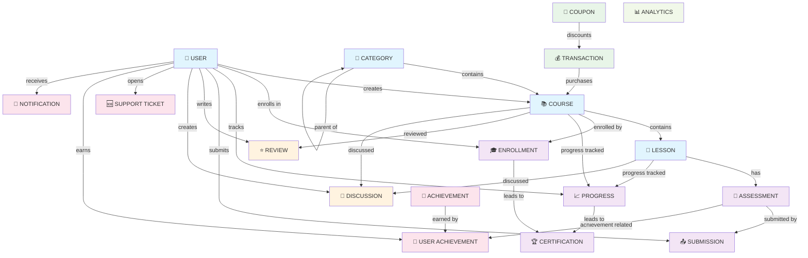

# EduConnectSa - Simplified ERD

## Core Entity Relationships



## Cardinality Summary

| Relationship                       | Cardinality | Description                                      |
| ---------------------------------- | ----------- | ------------------------------------------------ |
| **User ↔ Course**                  | 1:N         | One tutor creates many courses                   |
| **User ↔ Enrollment**              | 1:N         | One student enrolls in many courses              |
| **User ↔ Progress**                | 1:N         | One student tracks progress in many lessons      |
| **User ↔ Submission**              | 1:N         | One student submits many assessments             |
| **User ↔ Review**                  | 1:N         | One student writes many reviews                  |
| **User ↔ Discussion**              | 1:N         | One user creates many discussions                |
| **User ↔ Support Ticket**          | 1:N         | One user opens many tickets                      |
| **User ↔ User Achievement**        | 1:N         | One user earns many achievements                 |
| **Course ↔ Lesson**                | 1:N         | One course contains many lessons                 |
| **Course ↔ Enrollment**            | 1:N         | One course has many enrollments                  |
| **Course ↔ Progress**              | 1:N         | One course has progress tracked by many students |
| **Course ↔ Review**                | 1:N         | One course has many reviews                      |
| **Course ↔ Discussion**            | 1:N         | One course has many discussions                  |
| **Lesson ↔ Assessment**            | 1:N         | One lesson has many assessments                  |
| **Lesson ↔ Progress**              | 1:N         | One lesson has progress tracked by many students |
| **Assessment ↔ Submission**        | 1:N         | One assessment has many submissions              |
| **Achievement ↔ User Achievement** | 1:N         | One achievement earned by many users             |
| **Category ↔ Course**              | 1:N         | One category contains many courses               |
| **Category ↔ Category**            | 1:N         | One category has many subcategories              |

## Key Business Rules

### Unique Constraints

- ✅ **User Email**: Each user must have a unique email
- ✅ **Course Enrollment**: One student can only enroll once per course
- ✅ **Lesson Progress**: One student can only have one progress record per lesson
- ✅ **Assessment Submission**: One student can only submit once per assessment
- ✅ **Course Review**: One student can only review once per course
- ✅ **User Achievement**: One user can only earn each achievement once
- ✅ **Coupon Code**: Each coupon must have a unique code
- ✅ **Support Ticket**: Each ticket must have a unique number

### Data Integrity Rules

- 🔒 **Foreign Key Constraints**: All ObjectId references maintain integrity
- 🔒 **Cascade Operations**: Related data is properly managed
- 🔒 **Validation**: Schema-level validation for data types
- 🔒 **Indexing**: Performance optimization for frequent queries

### Workflow Rules

- 📋 **Enrollment → Progress → Certification**: Sequential learning progression
- 📋 **Assessment → Submission → Grade**: Evaluation workflow
- 📋 **Transaction → Course Access**: Payment enables course access
- 📋 **Achievement → Notification**: Gamification triggers notifications
- 📋 **Support Ticket → Resolution**: Support workflow with tracking

## Database Optimization

### Indexes for Performance

```javascript
// User queries
{ email: 1 } // Unique index
{ role: 1 } // Role-based queries

// Course queries
{ tutor: 1 } // Tutor's courses
{ category: 1 } // Category filtering
{ isPublished: 1 } // Published courses

// Enrollment queries
{ student: 1, course: 1 } // Unique compound index
{ student: 1, enrolledAt: -1 } // Student's enrollments

// Progress queries
{ student: 1, lesson: 1 } // Unique compound index
{ student: 1, course: 1, status: 1 } // Course progress

// Assessment queries
{ lesson: 1 } // Lesson assessments
{ type: 1 } // Assessment type filtering

// Review queries
{ course: 1, rating: -1 } // Course reviews by rating
{ student: 1, course: 1 } // Unique compound index

// Transaction queries
{ student: 1, status: 1 } // User transactions
{ status: 1, createdAt: -1 } // Transaction status

// Support queries
{ user: 1, status: 1 } // User tickets
{ assignedTo: 1, status: 1 } // Assigned tickets
{ priority: 1, status: 1 } // Priority-based queries
```

### Query Optimization Tips

1. **Use Compound Indexes**: For multi-field queries
2. **Covered Queries**: Include all needed fields in indexes
3. **Aggregation Pipelines**: For complex analytics queries
4. **Pagination**: Use skip/limit for large result sets
5. **Projection**: Only select needed fields
6. **Lean Queries**: Use `.lean()` for read-only operations
